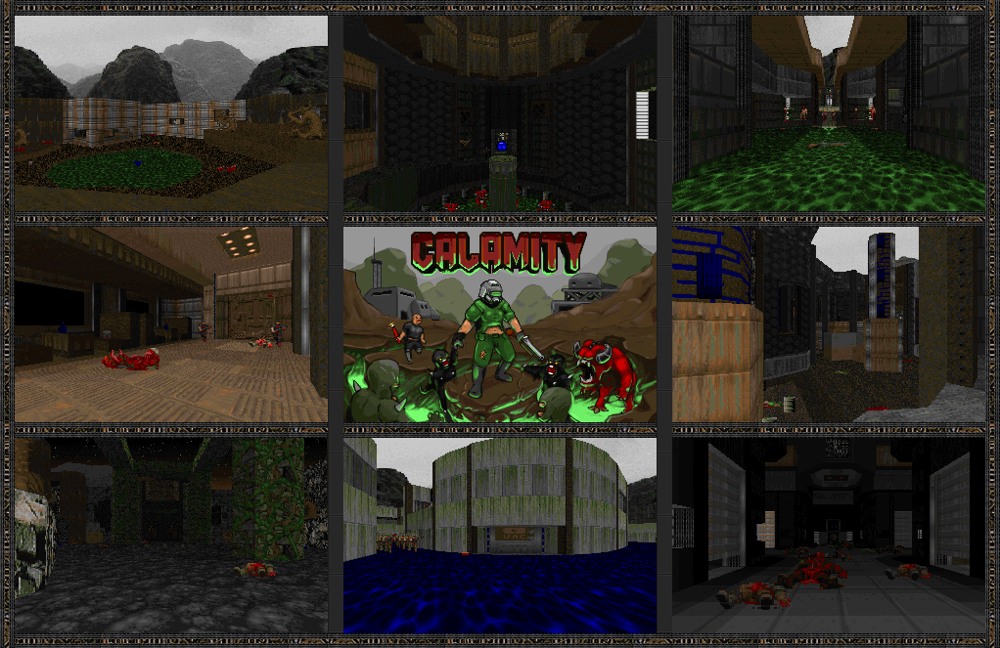

# Calamity (9 levels, Hell 3emlya Source Port, Ultimate Doom)
# STATUS: ✅RELEASED

**Download**: [Latest Release](https://github.com/Ear1h/WAD-Citadel/releases/download/v1.1/JOPA_Citadel.wad)

**Authors:** **Ear1h, Track Federal, Doom Wads**

**Calamity** is **a nine-level** episode replacing the original _Knee Deep in the Dead_, created exclusively for the **Hell 3emlya** source port - a fork of Chocolate Doom that partially supports modern mapping standards (MBF21-ID24) while retaining a vanilla aesthetic.

The story follows a soldier betrayed and brought before a world tribunal, branded a war criminal. Sent to serve out his punishment in the grim labor camps of Phobos, he arrives just as Hell breaks loose - and now, his only mission is **freedom**.

Main Features:

* Consistent **Episode 1** (E1) visual and design style throughout!
* Several creative gimmick-based maps!
* A unique **secret level**!
* Updated weapons from _Minicharge_!
* New enemies from _Volcanic Eruption_!
* Multiple difficulty levels to suit every player!

Alongside the release of this episode, I’m also presenting my own fork of Chocolate Doom - **Hell 3emlya**, developed specifically for CALAMITY.
It introduces new features and expands the classic DOOM formula while preserving its vanilla charm:

* New exclusive enemies!
* Reworked **Nightmare** (5th difficulty) - now a fair challenge, not pure chaos
* _Alternative fire mode!_
* Training map to showcase gameplay mechanics!
* No random damage!
* Enhanced enemy abilities!
* **True ending** on E1M8!

# SCREENSHOTS

