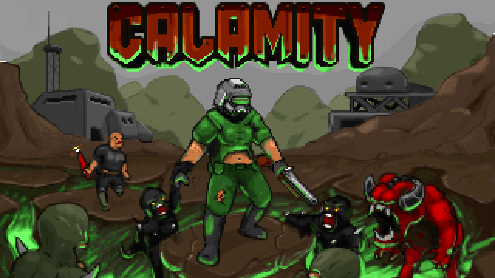

# Calamity (9 levels, Hell 3emlya Source Port, Ultimate Doom)
# STATUS: ✅RELEASED

**Authors:** **Ear1h, Track Federal, Doom Wads**

**Calamity** is **a nine-level** episode replacing the original _Knee Deep in the Dead_, created exclusively for the **Hell 3emlya** source port - a fork of Chocolate Doom that partially supports modern mapping standards (MBF21-ID24) while retaining a vanilla aesthetic.

The story follows a soldier betrayed and brought before a world tribunal, branded a war criminal. Sent to serve out his punishment in the grim labor camps of Phobos, he arrives just as Hell breaks loose - and now, his only mission is **freedom**.
